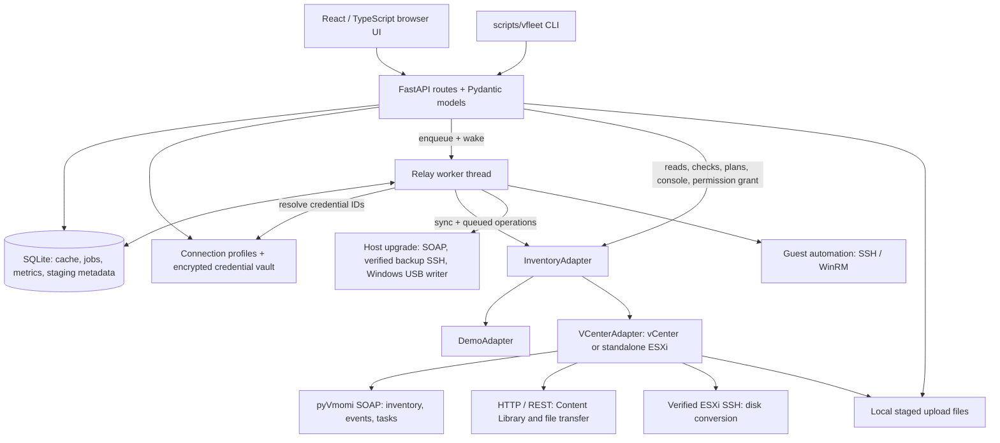

# vFleet

A local web console and CLI for VMware vCenter and standalone ESXi: browse inventory, monitor resource use, and manage VM, host, and datastore workflows through a persistent local job queue.

This talks only to endpoints you configure. UI-saved credentials live in vFleet's portable encrypted JSON vault; `.env` is retained as an explicit bootstrap option. It is an operator tool, not a scanner for systems you do not administer.

## Contents

- [Interface and everyday workflows](#interface-and-everyday-workflows)
- [Feature reference](#what-is-possible)
- [Standalone ESXi](#standalone-esxi-mode) and [assisted upgrades](#assisted-esxi-host-upgrades)
- [Guest automation and credentials](#guest-automation-and-the-automation-vault)
- [Storage reconciliation](#storage-reconciliation)
- [Limits](#honest-limits)
- [Architecture and request flow](#architecture-and-request-flow)
- [Persistent relay and recovery](#local-relay-flaky-vpn)
- [Demo quick start](#quick-start-demo-no-vcenter)
- [Saved connections](#manage-connections-from-the-ui)
- [Environment bootstrap](#connect-your-vcenter-via-env)
- [CLI](#cli-automation)
- [Single-port deployment](#production-style-single-port)
- [Configuration](#configuration-reference)
- [Ownership](#naming-convention) and [reclaim scoring](#reclaim-heuristics)
- [Source layout](#layout), [validation](#tests), and [troubleshooting](#troubleshooting)

## Highlights

- Browse clusters, hosts, VMs, and datastores; group labs by owner and export resource reports.
- Monitor CPU, memory, and storage with historical charts and host/datastore filters.
- Review single or bulk VM hardware changes, power actions, migrations, and disk conversions before execution.
- Deploy VMware Tools to Windows, Linux, and pfSense guests using encrypted saved credentials and optional SSH jump hosts.
- Review storage cleanup candidates and reclaim idle labs with explicit confirmations.
- Keep cached inventory and persistent jobs locally for interrupted VPN connections; try the included demo without a VMware endpoint.

Built with FastAPI, React, TypeScript, SQLite, and pyVmomi. See the [changelog](CHANGELOG.md) for release history.

## Interface and everyday workflows

vFleet runs on the operator's machine or a dedicated local service host. Choose one active connection profile, inspect its inventory, review an operation, and follow its result in **Jobs**. Saved profiles make it possible to switch between environments, but one running backend manages one active endpoint at a time.

| Page | What it does |
| --- | --- |
| **Overview** | Summarizes infrastructure capacity, utilization, clusters, and hosts to orient the operator before drilling into individual VMs. |
| **Monitoring** | Charts CPU, memory, and storage history using Recharts, with time, owner, host, and datastore scope controls. |
| **Hosts** | Shows host inventory; a standalone ESXi connection also exposes host health, services, maintenance, lifecycle, time, storage administration, and guided ESXi upgrade/recovery. |
| **Machines** | Searches and filters VMs, sorts resource columns, shows ownership, placement, power, IP, Tools, disk provisioning, and memory details, and supports single or bulk selection. |
| **Datastores** | Displays capacity and accessibility, browses remote folders, stages uploads, creates folders, deletes confirmed paths, reviews storage reconciliation, and exposes migration privilege checks. |
| **Jobs** | Shows queued/running work, retry status, progress, results, and errors for the active endpoint. Supports retry, cancellation of waiting work, and terminal-history cleanup. |
| **Vault** | Manages reusable guest and service credentials with global or endpoint-specific scope. Passwords and tokens are encrypted separately from metadata. |
| **Owners** | Aggregates VM counts, power states, configured resources, and reclaim candidates by owner or recorded deployer; exports CSV reports. |
| **Reclaim** | Ranks idle, oversized, or inactive VM candidates and exposes reviewed shutdown, power-off, or delete-from-disk actions. Suggestions never delete VMs automatically. |

The connection drawer handles saved profiles and optional SSH access paths. The rail also exposes the UI token and appearance controls. Theme presets, palette/type preferences, and the UI token are stored in the browser's local storage; vSphere and guest passwords are managed by the backend vault.

### VM lifecycle and placement

- **New VM** deploys an existing remote template with a name, datastore, cluster/host, inventory folder, CPU/RAM overrides, and optional power-on. A chosen host can have a per-VM DRS override. This is template cloning, not an empty-VM or OVA import wizard.
- **Migrate / Clone** offers relocation, clone while retaining the original, and clone followed by explicitly confirmed source deletion. Relocation can change host, datastore, provisioning, network, and inventory folder. Clone modes operate on a single source VM.
- **Actions** includes rename, VMRC console launch, opening the VM in the VMware web interface, power operations, mounting the Tools installer, and guided disk conversion. VMRC must be installed locally to handle its launch URI; the console client also needs network access to VMware infrastructure.
- **Configure hardware** previews a shared desired configuration across selected VMs, then records per-VM blockers and results. Review the shutdown and restart choices before applying changes to running guests.
- **Deploy VMware Tools** adds guest-side installation and verification to the simpler mount-installer action. See the guest automation section for prerequisites and platform behavior.

Capabilities reported by the endpoint drive which actions are available. A visible feature still requires the VMware privileges, license, VM state, and network access needed to execute it.

## What is possible

| Need | How | Notes |
| --- | --- | --- |
| Authenticate | vSphere session via [pyvmomi](https://github.com/vmware/pyvmomi) (SOAP) | Auto-detects vCenter (`VirtualCenter`) or direct ESXi (`HostAgent`). |
| Clusters, hosts, VMs | PropertyCollector inventory | Names, power state, guest OS, Tools, IP, configured vCPU/RAM, current host/cluster. Cached locally so the UI keeps working if the VPN drops. |
| CPU / memory utilization | `summary.quickStats` | Live usage (MHz / guest memory). This is the same family of numbers the vSphere UI uses, not guest-inside telemetry. |
| Power on / off / reset / suspend | Local job queue → VIM power methods | **Guest shutdown/reboot** needs VMware Tools. Hard power-off does not. Queued on disk; retried after disconnects. |
| Install VMware Tools | Windows WinRM + host Tools ISO; Linux SSH + `open-vm-tools`; pfSense SSH + `pfSense-pkg-Open-VM-Tools` | Single or bulk action. Uses encrypted Automation Vault credentials, pins target and optional jump-host SSH keys, and gives every guest an independent endpoint-bound job. |
| Configure VM hardware | Reviewed local job → power workflow → `ReconfigVM_Task` | Single or bulk shared desired state for vCPU, RAM, one disk target size, and datastore ISO mount/eject. Powered-on VMs can use an explicit guest-shutdown workflow, an optional forced-power-off fallback, and restoration of VMs that were originally running. Disk shrink is never allowed. |
| Migrate host / convert disks | Local job → vCenter `RelocateVM` or verified ESXi SSH | vCenter uses Storage vMotion. Direct ESXi uses an allowlisted `vmkfstools` clone because HostAgent can reject in-place relocation. **50 VMs per job** is a vFleet relay cap; extra VMs are deferred to a second batch. |
| Reconcile storage | Live inventory + conversion history + guarded datastore scan | Single VM, bulk selection, or full datastore scan. Finds preserved conversion sources, unattached VMDKs, and unregistered VM folders without deleting anything until a fresh plan and explicit confirmation. |
| Create VM | Clone from a template already on the remote side | Small SOAP call. Prefer this over uploading an OVA across a WAN. Resumes by reattaching the vCenter task. |
| Datastores | Inventory + datastore browser | Capacity, free space, browse folders, mkdir, delete file. Last listing is cached when vCenter is unreachable. |
| Upload ISO / OVA | Local staging, then resumable push | File lands on this machine first. The relay then uploads via Content Library (byte resume) or datastore PUT with retry. |
| Group by username / corp prefix | Name regex + optional vCenter custom fields | Default: `mzipkin-win11-lab` → owner `mzipkin`. If a VM has a custom field named Owner/User/CreatedBy, that wins. |
| Per-user report | Aggregated in the Owners view | VM count, on/off/suspended, total vCPU, total RAM, idle candidates. CSV export. |
| “Not accessed in a long time” | **Inferred**, not true OS last-login | vCenter does not store Windows/Linux last-login. vFleet uses last console ticket, power events, reconfigure/migrate events (lookback window), and `bootTime`. Idle CPU/RAM on a powered-on VM is the stronger reclaim signal. |
| Reclaim oversized idle labs | Score + confirm UI | Flags powered-on VMs with low utilization, large configured allocations, and stale activity. You can guest-shutdown, hard power-off, or **delete the VM from disk** (powers off first). Destroy datastore is not exposed. |

The vSphere **REST** Automation API can list VMs and do power operations, but live performance and event history are still best through the SOAP APIs. That is why the backend uses pyvmomi rather than REST-only.

## Standalone ESXi mode

Connect to an ESXi management address exactly as you would connect to vCenter. vFleet detects the endpoint and keeps the existing vCenter adapter/relay architecture intact; vCenter-only controls are hidden rather than emulated.

- Inventory, VM console/power/rename/delete, datastore access, and host administration use the vSphere SOAP API directly on the host.
- The **Hosts** view becomes a direct-host console for maintenance mode, guarded reboot/shutdown, ESXi Shell/SSH/NTP service state, NTP configuration, storage rescan, and support-bundle generation.
- VM **Actions → Convert disk provisioning** first builds a disk-by-disk plan. RDM, encrypted, shared, snapshot-dependent SSH, stale-plan, and endpoint-switch hazards are blocked before a job is queued.
- **Machines → Configure hardware** applies one reviewed configuration to up to 50 VMs. It can automatically expand the target scope to every VM in the selected cluster(s), while retaining per-VM blockers and results. Disk selection is ordinal (`Disk 1`, `Disk 2`, …) so different vSphere device keys do not break a bulk change. The optional power workflow requests guest shutdown through VMware Tools, forces power off after two minutes only when explicitly enabled, and powers back on only VMs that were running when execution began.
- vCenter-only DRS, roles, templates, Content Library, and cross-host migration remain available only when a vCenter endpoint reports those capabilities.
- Standalone HostAgent can advertise relocation capabilities but reject an in-place disk format change with `NotSupported`, even on a licensed host. Automatic disk conversion therefore uses verified SSH on direct ESXi. vFleet temporarily starts the SSH service for the job, restores its prior stopped state afterward, limits execution to `vmkfstools` cloning, and preserves source VMDKs. The API relocation path remains an explicitly labeled advanced option.
- Disk conversions reconcile storage by default. A preserved source is cleanup-eligible only when the replacement is attached and a post-conversion boot is validated with VMware Tools. If Tools is absent, the UI offers the existing automated Tools deployment or a manual post-boot validation acknowledgement. Powered-off VMs remain blocked.

Every job records the endpoint fingerprint it was created for. A queued task will fail closed rather than run after the operator switches to a different vCenter or ESXi host.

### Assisted ESXi host upgrades

Direct ESXi connections now have an **ESXi upgrade** panel under **Hosts**. It inspects
an original installer ISO and the live host, then queues guarded configuration backup,
graceful VM shutdown and maintenance entry. On servers without remote boot control,
vFleet can enumerate a locally attached USB, require its exact disk identity and typed
erase phrase, write the verified ISO bit-for-bit through elevated Windows PowerShell,
and verify the full USB read-back hash. Boot the installer manually; vFleet then verifies
the upgraded host and restores the saved VM power states. Host inventory, guest shutdown,
maintenance, and recovery use SOAP; verified SSH is opened only for the host configuration
backup and closed immediately afterward. See [the upgrade runbook](ESXI_UPGRADE.md) for
supported scope, version/license checks, failure behavior, and recovery procedures.

The guided sequence is **inspect media/host → review prerequisites and startup order → prepare → manually boot/install → verify and restore**. Preparation reserves the endpoint against unrelated mutations, persists the host configuration backup and its hash, gracefully shuts down originally running VMs in reverse startup order, and enters maintenance mode. A shutdown timeout stops the workflow; it never forces power off.

Recovery checks host identity, expected build, datastore accessibility, and VM UUID/VMX registrations before restoring the recorded power states. An unresolved mismatch retains the reservation. **Abort / restore original host** requires the original build and does not downgrade ESXi. USB creation requires a Windows PowerShell-capable controller path and explicit disk-erasure confirmation; it is not a portable macOS/Linux USB writer. A launched USB write with uncertain state is not automatically repeated.

## Guest automation and the Automation Vault

The **Vault** page stores reusable Windows/WinRM, Linux/SSH, and general service credentials. Non-secret metadata is portable JSON; each password or token is a separate AES-256-GCM record protected by the same external master-key strategy used for vSphere connections. API responses and job payloads contain credential IDs only.

Select one or more powered-on VMs and choose **Deploy VMware Tools**:

- Windows Server and desktop guests use WinRM with encrypted NTLM messages (or HTTPS), verify local-administrator access, mount the ESXi/vCenter-provided Tools ISO, run the silent installer, verify Tools after the scheduled reboot, and restore prior CD media.
- Linux guests use password-authenticated SSH with a reviewed SHA-256 host-key fingerprint. The relay installs the distribution-supported `open-vm-tools` package through apt, dnf/yum, zypper, tdnf, or apk and validates `vmtoolsd`.
- pfSense guests use a root SSH credential and the signed `pfSense-pkg-Open-VM-Tools` package from the firewall's configured pfSense repository. Preflight fails closed unless the target identifies itself as pfSense, and the job verifies `vmtoolsd` without requesting a reboot.
- Saved vCenter and standalone ESXi profiles can define a default one-hop SSH access path using a separately vaulted credential and pinned jump-host key. The jump-host type can be auto-discovered or set to Windows OpenSSH/PowerShell or Linux/Unix. VMware Tools deployments inherit it automatically, while operators can disable or override it for one deployment.
- SSH guests can optionally connect through that inherited or one-off jump host. Both host keys are reviewed and pinned, and neither password enters the job payload. Standalone ESXi's allowlisted SSH disk-conversion fallback uses the saved access path too; vCenter HTTPS/SOAP remains direct.
- Mixed and bulk selections remain independent jobs. One guest failure does not roll back or fail other guests.
- **Run a remote dry run before queueing** is enabled by default. It authenticates, verifies platform/root access and pinned keys, and checks package state without installing; operators can explicitly skip it for restricted environments, and the review banner records that choice.
- The Machines memory cell distinguishes guest-active memory from ESXi host-consumed memory and displays balloon, swap, and compression counters when non-zero; the VM identity line also shows whether VMware Tools is running.

The guest must be directly reachable from the vFleet host or reachable through the configured SSH jump host. Windows requires WinRM and an administrator credential; Linux requires SSH and root or sudo; pfSense requires root SSH. VMware Guest Operations cannot bootstrap a first Tools installation because that API itself depends on a running Tools agent.

## Storage reconciliation

Use **Machines → Reconcile storage** for one or more selected VMs, or **Datastores → Reconcile inventory** for an endpoint-wide review. The scan compares live disk attachments with successful conversion results and first-level datastore folders.

- Preserved source disks from vFleet conversions are high-confidence candidates only when the replacement disk remains attached.
- VMware Tools plus a recorded post-conversion boot provides automated validation. Without Tools, power on the VM and manually validate guest operation before acknowledging cleanup.
- Unattached VMDKs and directories containing VM files but no current attachment are review-only candidates. They may represent an intentionally unregistered VM, backup, or recovery copy.
- Cleanup rebuilds the plan server-side, refuses stale inventory or changed datastore state, and queues each explicitly confirmed item as an independent endpoint-bound delete job.

## Honest limits

- **Guest last login / “who is using this desktop”** is not collected. The Automation Vault and Tools deployment are explicit opt-in guest access; vFleet does not scan guest accounts or retain command output containing secrets.
- **vSphere Tags** are a separate tagging service. v1 reads **custom fields** and the **VM name prefix**. Tags can be added if you use them for owner.
- Monitoring retains up to 14 days of samples locally and requests available history from vSphere `PerformanceManager` (up to 14 days for vCenter; one day for direct ESXi). Actual coverage depends on the endpoint's available statistics and how long vFleet has collected samples. Demo history is synthetic.
- Power actions are **dangerous**. The UI requires an explicit confirm. Default bind is `127.0.0.1`. Optional `UI_TOKEN` gates the API.

## Architecture and request flow

The application is a React single-page frontend and a FastAPI backend with an in-process relay thread. SQLite provides durable local state; the same adapter interface supports synthetic demo data and live VMware endpoints. No external message broker or separate database service is required.



### Backend responsibilities

| Layer | Responsibility |
| --- | --- |
| `config.py`, `session.py`, `profiles.py` | Read settings, normalize endpoints, load saved connections, migrate legacy credentials, and manage the active session. |
| `models.py` | Define Pydantic request/response contracts for inventory, plans, jobs, credentials, metrics, and operations. |
| `main.py` | Construct shared services at startup; validate requests, tokens, confirmations, and endpoint scope; serve API responses and the built UI. |
| `relay.py` | Refresh inventory/catalog, sample metrics, check connectivity, claim persistent jobs, dispatch operations, and save progress or retry state. |
| `store.py` | Maintain the SQLite schema, cached snapshots/listings, job history, upload offsets, metric retention, and local staging files. |
| `adapters/base.py` | Define the common inventory, capability, task, and operation interface. |
| `adapters/demo.py` | Supply synthetic infrastructure and simulated operations for exploration and automated tests. |
| `adapters/vcenter.py` | Implement the shared vCenter/HostAgent integration, with endpoint-specific capabilities and VMware task handling. |
| `power.py`, `vm_hardware.py`, `vm_storage.py`, `storage_reconciliation.py` | Build and enforce operation-specific plans, validation, power sequencing, disk safeguards, and cleanup evidence. |
| `transfer.py`, `esxi_ssh.py`, `guest_tools.py` | Handle HTTP transfers, constrained host SSH operations, and platform-specific guest automation. |
| `upgrade_api.py`, `host_upgrade.py`, `upgrade_media.py`, `upgrade_ssh.py`, `usb_media.py` | Queue and persist assisted upgrade plans, validate installer media, prepare/recover the host, back up configuration, and write verified USB media. |
| `credential_vault.py`, `automation_vault.py` | Encrypt secret records and resolve scoped guest/service credentials at execution time. |
| `grouping.py`, `reclaim.py`, `metrics.py` | Derive owner groups, reclaim scores, utilization summaries, and historical samples. |

### Startup and reads

1. FastAPI opens the local store and vault, imports configured bootstrap credentials or restores the active saved profile, resolves any saved jump-host association, and builds the selected adapter.
2. The relay recovers interrupted jobs and performs an initial inventory synchronization. It subsequently refreshes inventory/catalog, records metrics, checks connectivity, and processes due jobs.
3. The main UI polls local data approximately every eight seconds while the login dialog is closed. API requests use the typed client in `frontend/src/api.ts`; Python contracts and TypeScript types are maintained separately.
4. Inventory reads prefer the last saved snapshot. The API decorates responses with connection, cache age, synchronization, and stale-state information. With no cached inventory, it attempts a live read and returns an error if the endpoint cannot be reached.
5. Catalogs and datastore listings also have cache support. Monitoring reads local metric series, seeded from available VMware history and extended by subsequent relay samples. Series are downsampled for display.

The relay handles queued infrastructure work, but it is **not the exclusive remote caller**. Connection tests/login (including opt-in temporary SSH service setup), live reads, hardware/storage previews, guest preflight, console tickets, and migration permission assignment can call the adapter or remote services during an API request. Permission assignment is a confirmed synchronous action, not a durable relay job.

### Mutation flow

A typical queued action follows `UI/CLI → request model → route validation → endpoint-bound job → relay → adapter → VMware task → persisted result`. The route stores the job before waking the worker, so the browser does not need to remain open during execution. Multi-step operations persist task IDs and phase/progress data where supported, allowing the worker to resume or reattach instead of blindly restarting a remote task.

Confirmation is operation-specific. Destructive and infrastructure-changing routes retain explicit review/`confirm` checks; template deployment uses its submitted creation parameters. Preview-based operations validate the selected targets and relevant live state again before execution. Bulk operations can produce mixed per-VM results, so inspect the job details as well as its top-level status.

### Local data and security boundaries

| Location | Contents and handling |
| --- | --- |
| `DATA_DIR/vfleet.db` | SQLite inventory/catalog/listing cache, jobs with payload/progress/results, staging metadata, metrics, and upgrade plans/reservations. Uses WAL mode and in-process locking. Inventory and datastore paths remain sensitive even though passwords are vaulted. |
| `DATA_DIR/staging/` | File bytes uploaded from the browser before remote transfer. Allow local disk space for the full staged file. |
| `DATA_DIR/upgrade-backups/` | Per-upgrade host configuration backups; archive hashes are recorded in the upgrade plan. Treat these archives as sensitive. |
| `DATA_DIR/connections.json` | Saved endpoint identities, connection options, active-profile metadata, and optional jump-host credential references. |
| `DATA_DIR/automation_credentials.json` | Guest/service credential metadata and scope. |
| `DATA_DIR/credentials.enc.json` | Individually encrypted vSphere, SSH, and automation secret records. |
| `~/.vfleet/credential.key` or configured external key | Master key required to decrypt the vault. Keep it separate from the data backup and out of source control. |
| Browser local storage | UI token and display preferences for that browser origin. |

`UI_TOKEN` is a shared API gate, not a multi-user identity system or per-user RBAC. Most operational routes enforce it when configured; health/version/changelog and the static UI are public. VMware permissions remain the authority for remote operations. Set a non-empty token before exposing the backend beyond localhost; the launch script does not automatically enforce that deployment requirement.

`VCENTER_INSECURE=true` accepts untrusted certificates and is the supplied lab default. Set it to `false` when the endpoint has a trusted certificate. SSH workflows separately verify host keys. The browser normally sends operations to the local API; console launch is an exception because VMRC or the VMware web interface connects to the remote infrastructure.

Use a single backend process for one `DATA_DIR`. The worker, current adapter, and connection-switch lock live in process memory; this is not a distributed queue or a multi-worker deployment design. For a consistent backup, stop vFleet and copy its data directory, then preserve the external key through a separate protected backup process. Restoring queued jobs can make them eligible to run again; review their state and target before reconnecting.

## Local relay (flaky VPN)

The browser submits work to the local backend. Its relay executes queued operations against the active endpoint.

- Last-good inventory, datastores, and templates live in `data/vfleet.db`. If the session drops, the console stays up and is marked stale.
- Clones, uploads, mkdir, file delete, and power actions are jobs on disk. On reconnect the worker retries with backoff and reattaches in-flight vCenter tasks.
- Uploads are staged locally first (so a browser refresh cannot lose the file), then pushed. Content Library is preferred because vCenter can resume at a byte offset. If that privilege is missing, the worker falls back to a datastore HTTP PUT and retries.
- Clone-from-template does **not** copy a disk over the VPN. The template must already exist on the remote side.

### Job states and recovery

```text
queued → running → succeeded
             ├──→ retrying → running
             └──→ failed
queued / retrying → cancelled
failed / retrying / cancelled → queued (explicit retry)
```

- The relay executes one claimed job at a time. Due jobs are selected in creation order; a job waiting for backoff does not block another due job.
- Retriable failures preserve progress and use exponential backoff (currently 2 seconds initially, capped at 256 seconds), with a default ceiling of 80 attempts. Permanent failures stop immediately.
- On process startup, jobs left `running` become `retrying`. Task-based workflows reattach using stored VMware task IDs where implemented.
- Operations that supply an idempotency key reuse an open job with the same key; this is not a global exactly-once guarantee. Recovery depends on the operation and the remote task state.
- Cancellation is available for queued/retrying jobs. It does not abort an already running VMware task or reverse completed changes. Manual retry may reset operation-specific progress and should follow review of the prior result.
- A local upload must finish before its remote-transfer job can be created. Once staged, browser navigation does not stop the relay transfer. Resumption depends on the selected remote protocol; a server rejecting byte resume can require transfer from zero.
- Cached inventory remains inspectable during disconnection, but fresh plans and remote operations can still fail or wait for connectivity. Long-running jobs can delay periodic synchronization because execution and periodic work share the relay thread.

Set `DATA_DIR` if you want the SQLite file and staging directory somewhere other than the repository's `data/` directory.

## Quick start (demo, no vCenter)

Install Git, Python 3 with `venv` and `pip`, and Node.js with npm. The launch scripts require Bash and install the backend and frontend dependencies locally.

```bash
git clone https://github.com/VonZippySays/vFleet.git
cd vFleet
chmod +x scripts/dev.sh scripts/run.sh
./scripts/dev.sh
```

If GitHub requires authentication for your checkout, use an account with repository access. If you already have a local checkout, run the launch commands from that directory.

Open [http://127.0.0.1:5173](http://127.0.0.1:5173). Demo data is shaped like a lab cluster with user-prefixed VM names so grouping and reclaim can be clicked through immediately.

## Manage connections from the UI

The connection card in the left rail opens a searchable drawer of saved vCenter and standalone ESXi endpoints. Add, edit, switch, or remove profiles there; vFleet detects the endpoint type after connecting and exposes only the supported controls.

- **Test** detects and reports the endpoint without saving credentials or switching away from the current session.
- **Connect & save** tests first, stores non-secret profile metadata in `data/connections.json`, encrypts passwords in `data/credentials.enc.json`, and switches to live inventory.
- Profile API responses never include passwords. A blank password while editing reuses the retained secret only when the saved endpoint, user, and port still match.
- **Network access** on Add/Edit connection assigns an optional jump-host address, host type, Automation Vault credential, and pinned host key to that profile. **Auto detect** probes the authenticated SSH shell without changing the host; an explicit Windows OpenSSH/PowerShell or Linux/Unix choice is available for restricted shells. **Test jump host & pin key** verifies authentication and host identity before the association can be saved.
- **Standalone ESXi SSH fallback** can detect and pin its host key directly from Add/Edit connection. Leaving the fingerprint blank makes Test or Connect & save discover it automatically, trying direct SSH before a verified jump host. An existing fingerprint is retained.
- **Allow temporary SSH start through the vSphere API** is opt-in. If discovery fails, setup uses the supplied credentials to authenticate to the direct ESXi API, starts TSM-SSH only if stopped, detects the key, tests SSH authentication, and restores the original service state. Open jobs block this temporary setup, and failure to restore SSH is reported explicitly. It does not change SSH startup policy.
- A referenced jump credential cannot be deleted until it is removed from the connection profile. Connection profiles store only its credential ID; the secret stays in the encrypted Automation Vault.
- Switching is refused while queued or running work is bound to the current endpoint.
- **Stay in demo** closes the dialog. **Disconnect** / **Forget saved credentials** are in the rail after you connect.

The Jobs view is scoped to the current endpoint fingerprint. Completed history from other profiles stays hidden until that profile is selected. Queued/retrying jobs can be cancelled; terminal rows can be removed individually or cleared together without deleting active work.

The credential vault uses AES-256-GCM with a unique nonce and profile-bound authenticated data for every saved connection. Its randomly generated master key defaults to `~/.vfleet/credential.key`, outside the repository and `DATA_DIR`. Override that portable path with `VFLEET_MASTER_KEY_FILE`; service deployments should mount the key separately. `VFLEET_MASTER_KEY` can inject a base64-encoded 32-byte key directly into the process environment.

Legacy plaintext profiles and `.env` passwords are migrated automatically after the encrypted records are written successfully. `.env` remains an explicit bootstrap/development input, but UI-created connections never write secrets into it.

## Connect your vCenter via `.env`

1. Copy `.env.example` → `.env` (the dev script does this if `.env` is missing).
2. Set:

```
APP_MODE=auto
VCENTER_HOST=vcenter.example.com
VCENTER_USER=readonly-or-operator@vsphere.local
VCENTER_PASSWORD=...
VCENTER_INSECURE=true
```

3. Restart `./scripts/dev.sh`. On the first successful start, vFleet imports the connection into the encrypted vault and clears the plaintext password fields from `.env`.

For a standalone host, use the same variables with its management address and an ESXi account. Optional SSH fallback settings are documented in `.env.example`; leave `ESXI_SSH_ENABLED=false` unless you specifically need it.

## CLI automation

The CLI calls the local FastAPI/relay boundary, so it gets the same confirmations, endpoint binding, retry state, and audit trail as the UI:

```bash
# The launch scripts use 8081; the CLI itself defaults to 8080.
export VFLEET_API_URL=http://127.0.0.1:8081
scripts/vfleet connection
scripts/vfleet inventory --kind vms
scripts/vfleet host
scripts/vfleet disk-plan VM_ID --target thin
scripts/vfleet disk-convert VM_ID --target thin --yes
scripts/vfleet hardware-plan VM_ID_A VM_ID_B --cpu 4 --memory-gib 8
scripts/vfleet hardware-config VM_ID_A VM_ID_B --disk 1 --disk-gib 120 --iso-datastore DATASTORE_ID --iso-path isos/rhel9.iso --yes
scripts/vfleet hardware-config VM_ID_A VM_ID_B --cpu 2 --shutdown-before --force-power-off --power-on-after --yes
scripts/vfleet credentials
scripts/vfleet credential-add "Linux admins" --kind ssh --user operator
scripts/vfleet connect vcenter.example.com --user administrator@vsphere.local --jump-address access.example.com --jump-host-type auto --jump-credential-id JUMP_CREDENTIAL_ID
scripts/vfleet tools-deploy CREDENTIAL_ID VM_ID=10.20.1.8 --yes
scripts/vfleet tools-deploy PFSENSE_CREDENTIAL_ID VM_ID=10.0.0.1 --os pfsense --jump-address 192.168.1.60 --jump-host-type windows --jump-credential-id JUMP_CREDENTIAL_ID --yes
scripts/vfleet jobs
scripts/vfleet job JOB_ID --wait
```

`tools-deploy` inherits the active connection profile's jump host by default. Pass `--no-jump` to use direct guest SSH for one invocation, or pass explicit `--jump-*` options to override the profile.

Host lifecycle, service, NTP, storage-rescan, and support-bundle commands are listed by `scripts/vfleet --help`. Mutating commands require an interactive `yes` or `--yes`. Override the local endpoint with `VFLEET_API_URL`; use `VFLEET_UI_TOKEN` when the API is protected.

Keep `.env`, the encrypted vault, and especially the separate master key off git. Back up the key separately: losing it makes saved credentials unrecoverable. Use a dedicated service account with least privilege:

- Read-only on datacenters/clusters/hosts/VMs for inventory
- Virtual machine **Interaction** (power on/off/reset/console) only if you want actions enabled
- Virtual machine **Migrate** privileges if you want Host migrate / Thick→Thin:
  - `Resource.HotMigrate` for powered-on vMotion
  - `Resource.ColdMigrate` for powered-off migrate or disk-type convert
  - `Datastore.Relocate` when changing datastore or converting Thick/Thin
- **Datastores → vMotion / migration access** can assign a dedicated `vFleet-Migrate` role to the current login on a cluster or globally, if that login already has `Authorization.ModifyPermissions` (confirm required). It does not grant Administrator.
- Virtual machine **Inventory** (delete from disk) only if you want reclaim destroy enabled
- Datastore destroy is **not** used

## Production-style single port

```bash
./scripts/run.sh
```

Builds the UI and serves it from FastAPI at `http://127.0.0.1:8081` (8080 is often Homebrew nginx on this machine).

Set `UI_TOKEN` in `.env` and paste the same value into the left-rail **UI token** field if you bind beyond localhost. `run.sh` reads its bind host and port from the **shell environment**, not by sourcing `.env`; for example, `APP_PORT=8090 ./scripts/run.sh` changes its port. The development script always uses loopback ports 5173 and 8081.

The built frontend is served by FastAPI only when `frontend/dist` exists at backend startup. Development uses Vite's `/api` proxy to port 8081. API documentation is available at `/docs` and the schema at `/openapi.json` on the backend port.

## Configuration reference

Backend settings load from the repository-root `.env`, with process environment values taking precedence. See [`.env.example`](.env.example) for the bootstrap template and [`config.py`](backend/app/config.py) for the complete settings definition.

| Setting | Default | Purpose |
| --- | --- | --- |
| `APP_MODE` | `auto` | `auto` chooses live credentials when available, otherwise demo; explicit modes are `demo`, `vcenter`, and `esxi`. Startup can restore an active saved profile outside explicit demo mode. |
| `APP_HOST`, `APP_PORT` | Settings: `127.0.0.1`, `8080`; `run.sh`: `127.0.0.1`, `8081` | Launch binding follows the shell/script behavior described above. |
| `UI_TOKEN` | Empty | Optional shared `X-UI-Token` header check; required by the deployment guidance before non-loopback exposure. |
| `VCENTER_HOST`, `VCENTER_USER`, `VCENTER_PASSWORD`, `VCENTER_PORT` | Empty credentials; port `443` | Explicit endpoint bootstrap; saved profiles are preferred for normal switching. |
| `VCENTER_INSECURE` | `true` | Whether to bypass VMware certificate validation. |
| `DATA_DIR` | Repository `data/` | Persistent database, vault metadata/encrypted records, and staging. |
| `VFLEET_MASTER_KEY_FILE`, `VFLEET_MASTER_KEY` | `~/.vfleet/credential.key`; no injected key | External master-key file or base64-encoded 32-byte process secret. |
| `CACHE_TTL_SECONDS` | `20` | Adapter cache lifetime, allowed range 5–300 seconds. |
| `SYNC_INTERVAL_SECONDS` | `30` | Periodic relay inventory interval, allowed range 10–600 seconds. |
| `RELAY_TICK_SECONDS` | `1.0` | Worker loop wait, allowed range 0.2–30 seconds. |
| `CONNECT_TIMEOUT_SECONDS` | `20` | Connection timeout, allowed range 5–120 seconds. |
| `UPLOAD_CHUNK_BYTES` | `4194304` (4 MiB) | Declared setting, minimum 256 KiB; currently not consumed by the transfer implementation. |
| `NAME_GROUP_PATTERN`, `OWNER_FIELD_NAMES` | Leading name token; Owner/User/CreatedBy variants | Ownership derivation, described below. |
| `IDLE_DAYS`, `CPU_IDLE_PCT`, `MEMORY_IDLE_PCT` | `14`, `8`, `20` | Reclaim scoring thresholds. |
| `EVENT_LOOKBACK_DAYS` | `30` | Activity-event search window. |
| `ESXI_SSH_*` | Disabled; port `22`; timeout `30` seconds | Optional direct-host fallback identity, key/password, pinned host key, and timeout. Saved profiles can configure the access path. |
| `VFLEET_API_URL`, `VFLEET_UI_TOKEN` | CLI local endpoint; no token | CLI URL and token overrides; token otherwise falls back to backend settings. |

The CLI defaults to `http://127.0.0.1:8080`, while both launch scripts default to API port 8081. Set `VFLEET_API_URL=http://127.0.0.1:8081` for those scripts, or pass `--url` before the subcommand.

## Naming convention

Default pattern: `^([A-Za-z][A-Za-z0-9]+)`

| VM name | Owner |
| --- | --- |
| `mzipkin-win11-lab` | `mzipkin` |
| `jdoe_rhel_lab01` | `jdoe` |
| `achen.ml-gpu02` | `achen` |

Override with `NAME_GROUP_PATTERN` if your corp prefix is different (for example `^corp-([^-]+)-`).

## Reclaim heuristics

A powered-on VM scores higher when:

- CPU usage ≤ `CPU_IDLE_PCT` (default 8%)
- Guest memory usage ≤ `MEMORY_IDLE_PCT` (default 20%)
- No console/power activity for `IDLE_DAYS` (default 14)
- Large configured allocation (8+ GiB RAM or 4+ vCPU while CPU is idle)

The score adds 35 points for low CPU, 20 for low guest memory, 30 for old activity (or 10 when activity is unknown), 10 for at least 8 GiB configured RAM, and 5 for at least four mostly idle vCPUs. A score of 40 or more marks a powered-on VM as a candidate. Configured allocation is not a measurement of an explicit vSphere resource reservation.

Tune those in `.env`. Prefer **Guest shutdown** when Tools is running. **Delete from disk** is irreversible and requires a confirm.

## Layout

```text
backend/
  app/
    main.py, models.py, config.py       HTTP API, contracts, settings
    cli.py                             Local API command-line client
    relay.py, store.py                  Persistent queue, cache, metrics, staging
    session.py, profiles.py             Endpoint lifecycle and saved profiles
    credential_vault.py                Encryption and master-key management
    automation_vault.py                Scoped guest/service credential records
    adapters/{base,demo,vcenter}.py     Adapter contract and implementations
    power.py, vm_hardware.py            VM power and hardware workflows
    vm_storage.py                      Disk provisioning plans and conversion
    storage_reconciliation.py          Cleanup evidence and validation
    transfer.py, esxi_ssh.py            HTTP transfers and constrained ESXi SSH
    guest_tools.py                     Windows/Linux/pfSense Tools deployment
    upgrade_api.py, host_upgrade.py     Assisted host upgrade API and state machine
    upgrade_media.py, upgrade_ssh.py    ISO inspection and verified host backup
    usb_media.py                       Guarded Windows USB image writer
    grouping.py, reclaim.py, metrics.py Derived reports and utilization
    migration_access.py, errors.py      Privilege helpers and error classification
  tests/                               Isolated API, adapter, and workflow tests
  requirements.txt                     Pinned Python dependencies
frontend/
  src/
    App.tsx                            Navigation, shared state, inventory views
    api.ts, types.ts                   Fetch client and TypeScript contracts
    *View.tsx, *Modal.tsx               Feature pages and review dialogs
    ThemeContext.tsx, styles.css        Saved appearance and shared styling
  vite.config.ts                       Development server and API proxy
scripts/
  vfleet                               CLI launcher
  dev.sh, run.sh                        Development and built-UI launchers
  bump-version.py, install-hooks.sh     Version synchronization and Git hooks
ESXI_UPGRADE.md                         Upgrade runbook and lab validation record
VERSION, CHANGELOG.md                   Release metadata
AGENTS.md, AGENT_PROJECT_INDEX.md        Contributor guidance and source index
.env.example                           Bootstrap configuration template
data/                                  Local state and staged files (gitignored)
```

See [the project index](AGENT_PROJECT_INDEX.md) for additional contributor navigation. Optional Git hooks installed by `scripts/install-hooks.sh` bump and synchronize version metadata and add a changelog entry on commits.

## Tests

Run backend validation in an isolated demo environment:

```bash
cd backend
python3 -m venv .venv
source .venv/bin/activate
pip install -r requirements.txt
pytest
```

The test configuration selects the demo adapter, clears VMware connection environment values, and uses temporary storage and a temporary vault key. Coverage includes API/session behavior, saved credentials, queue/retry behavior, power/console operations, cloning/migration, hardware changes, disk conversion/reconciliation, transfers, metrics, guest Tools workflows, host upgrade/recovery, and USB safety. Adapter-focused tests use fakes/mocks; they do not establish compatibility with a live VMware deployment.

From the repository root, validate the frontend with:

```bash
cd frontend
npm install
npm run typecheck
npm run build
```

The build also runs TypeScript checking. There is no checked-in live-vCenter integration suite or CI workflow. The [upgrade runbook](ESXI_UPGRADE.md) separately records a completed ESXi lab upgrade; that is not automated integration coverage. Changes to VMware operations, privileges, transfers, or deployment paths need operator validation in an appropriate test environment in addition to local tests.

## Troubleshooting

| Symptom | What to check |
| --- | --- |
| UI loads but API requests fail | In development, confirm the API is on 8081 and Vite on 5173. An unrelated service on 8080 is not the vFleet backend. Check `/api/health` on the API port. |
| `401` or missing/invalid token | Enter the backend's `UI_TOKEN` in the UI token field, or supply `VFLEET_UI_TOKEN` to the CLI. Browser token storage is specific to its origin. |
| Stale inventory or retrying jobs | Review connection error/cache age and the Jobs detail, then check VPN, DNS, endpoint reachability, session credentials, and TLS settings. Cached data does not prove the remote operation succeeded. |
| Cannot switch connection | Check for an active upgrade reservation; complete its recovery or investigate its blocker. Resolve or cancel waiting work for the current endpoint; running jobs must finish. Endpoint binding prevents replay against another server. |
| Controls absent or VMware rejects an operation | Check endpoint capabilities, account permissions, license, and VM state. Standalone ESXi does not provide vCenter-only features. |
| Console does not open | Install VMRC for `vmrc://` launch or use the VMware web interface. Verify the client can reach the endpoint and has console privileges. |
| Tools deployment preflight fails | Verify guest IP/reachability, OS selection, WinRM or SSH access, required administrator/root/sudo rights, credential scope, and reviewed target/jump-host keys. |
| Vault credentials cannot be decrypted after moving data | Restore the matching external master key or configured key injection. Copying the encrypted JSON alone is insufficient. |
| Upload waits or restarts | Confirm local staging completed, local disk capacity, datastore permissions, and remote transfer errors. Datastore PUT may restart from zero when resume is unsupported. |
| Storage cleanup is blocked | Refresh inventory and rebuild the plan. Conversion sources need a still-attached replacement and post-boot validation; unregistered files can be legitimate recovery data. |

## License

Copyright (C) 2026 Michael Zipkin

This program is free software: you can redistribute it and/or modify it under the terms of the
**GNU Affero General Public License** as published by the Free Software Foundation, either version 3
of the License, or (at your option) any later version.

This program is distributed in the hope that it will be useful, but **WITHOUT ANY WARRANTY**;
without even the implied warranty of MERCHANTABILITY or FITNESS FOR A PARTICULAR PURPOSE.
See the [GNU AGPL v3](LICENSE) for details.

Key restriction: if you run a modified version of this software as a network service, you must
make the complete corresponding source code available to users of that service (AGPL §13).
